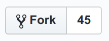

# iExec Dapps Registry

In order to list your dapp on the [iExec Dapp Store](https://dapps.iex.ec/), you need to make it into the iExec Dapp Registry FIRST. But relax, it's very easy:

Once you created and deployed your iExec Dapp using the [iExec SDK](https://github.com/iExecBlockchainComputing/iexec-sdk), here are the 5 steps that remain to enter this registry:

## 1. Github Fork this repo

clic on the github "Fork" button

[](https://github.com/iExecBlockchainComputing/iexec-dapps-registry/tree/v2#fork-destination-box)

## 2. Create 2 new folders

* **One** personal folder at the root **[MUST match your github user or organization name]**. Ex: `/iExecBlockchainComputing`.

* **One** folder for your dapp **[MUST match your dapp name]**. Ex: `/iExecBlockchainComputing/VanityGen`.

## 3. Commit `iexec.json`

Check that `iexec.json` respects below format:

* **description**: Must be at least 150 letters long
* **logo.png**: Must be 180px by 180px, square shape

```json
{
  "description": "Dapp description should be at least 150 letters long",
  "license": "ex: MIT",
  "author": "ex: Dupont",
  "social": {
    "website": "ex: https://super.dapp.io",
    "github": "ex: https://github.com/samr7/vanitygen"
  },
  "logo": "ex: logo.png [must be 180px by 180px, square shape]",
  "app": {
    "name": "Vanitygen",
    "price": 1,
    "params": {
      "type": "DOCKER",
      "envvars": "XWDOCKERIMAGE=iexechub/vanitygen"
    }
  }
}
```

## 4. Commit `deployed.json`

Check that `deployed.json` respects below format:

* **Kovan ID only => "42"**

```json
{
  "app": {
    "42": "0xfd3753bc4e4c5624a5fbc41c2632bd731d7e96fb"
  }
}
```

## 5. Github Pull Request

clic on this button to create a Pull Request:

[](https://github.com/iExecBlockchainComputing/iexec-dapps-registry/compare)

**We'll review you Dapp and if it meets all the above criteria, it will be added to the iExec Dapp Regsitry!**
