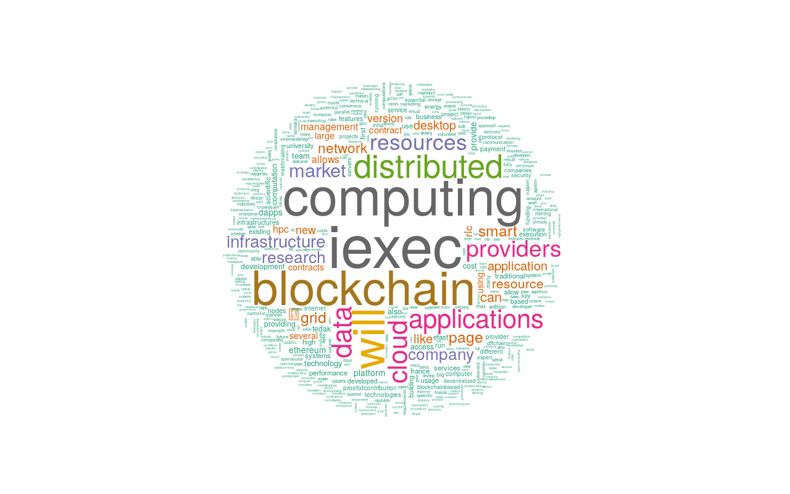

# R wordcloud
## Description
R is a free programming language and software environment for statistical computing and graphics that is supported by the R Foundation for Statistical Computing. The R language is widely used among statisticians and data miners for developing statistical software and data analysis. Polls, surveys of data miners, and studies of scholarly literature databases show that R's popularity has increased substantially in recent years

On the r-base docker image, wordcloud library and needed dependencies has been added in the iexechub/r-wordcloud image. 

You can see the corresponding [Dockerfile](./apps/Dockerfile) of this [iexechub/r-wordcloud image](https://hub.docker.com/r/iexechub/r-wordcloud/).

## [Dapp params](./iexec.js)

With create a wordcloud of the iExec Whitepaper : [iExec-WPv2.0-English.pdf](http://iex.ec/app/uploads/2017/04/iExec-WPv2.0-English.pdf).
We have create a [R script](./apps/iExecWordcloud.R) to analyse the pdf content and generate a png image. 

Those 2 inputs will be packed into [iExecWordcloudInputs.zip](./apps/iExecWordcloudInputs.zip) and set in the [dirinuri](https://github.com/iExecBlockchainComputing/iexec-dapp-samples/blob/r-wordcloud/iexec.js#L9) field of iexec.js.

##  Result

You can see the wordcloud result of the iExec Whitepaper !!! . It was generated by this [transaction](https://explorer.iex.ec/ropsten/tx/0x3c030ee382094014deb3b4ef0bf64b05d203403094abcf7d6cab36d26ed4cdd5) on ropsten  

