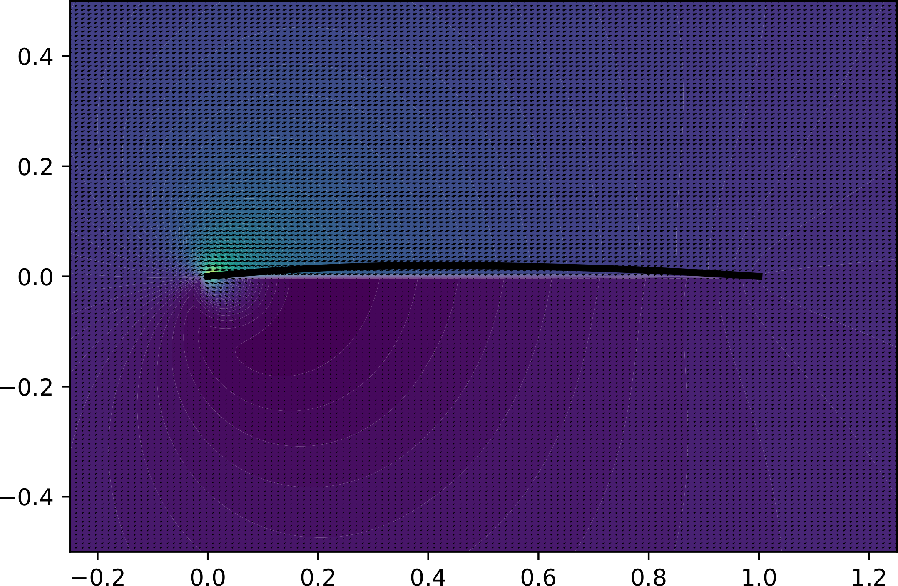

# fluxe

fluxe is a proof of concept for scientific computation on the iExec platform.

## Description
fluxe equation developped by [Arianne Gayout](https://www.researchgate.net/profile/Ariane_Gayout) and optimized by [Hadrien Croubois](https://hadriencroubois.com) to compute the pressure field produced by a [Naca4](https://en.wikipedia.org/wiki/NACA_airfoil) airfoil.

## Usage:
python3 apps/fluxe naca4 [-a angleOfAttack] [-g gridSize] [-o output]
* [naca4]         Naca4 profil. Valid profil are 2xxx and 4xxx, other profils might cause unexpected behaviour.
* [-a | --angle ] Angle of attack of the airfoil (default: 0)
* [-g | --grid  ] Resolution of the simulation grid (default: 64)
* [-o | --output] Output file and format (default: output.pdf)

## Example:

> python3 apps/fluxe.py 2400 -a 25 -g 128 -o example.pdf

## Dependencies:
* python3
	* argparse
	* matplotlib
	* pyplot
	* multiprocessing
	* numpy
	* scipy