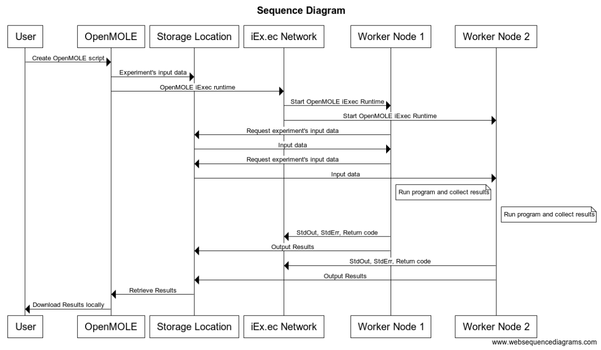

# Submission to DApp challenge: the OpenMOLE scientific platform, decentralised model exploration and parameter tuning on the iEx.ec network

## Idea proposal
[OpenMOLE](https://www.openmole.org) is a generic scientific exploration platform with a strong support for High-Throughput Computing environments. Its principal purpose is to provide advanced **model exploration methods and parameter tuning** based on distributed genetic algorithms. OpenMOLE exposes a workflow formalism to describe the experiments and as such, can serve as a generic description language for processing pipelines.

The power of OpenMOLE is further expressed in its ability to **automatically introduce parallelism to the underlying applications**. We exploit the intrinsic parallel aspect of data parallel problems without having to modify the target application’s source code. Studied applications are viewed as black-boxes by the platform, which ensures the required inputs and outputs travel to the remote execution nodes.

The typical uses of OpenMOLE are **model calibration, model exploration, machine learning, optimisation and data processing**. End-users can specify the execution environment for each stage of the experiment. OpenMOLE currently supports clusters (Slurm, HT Condor, PBS, …) and grids such as the **European Grid Infrastructure (EGI)**.

This project proposal introduces an OpenMOLE DApp leveraging the computing resources of the iEx.ec network to decentralise the execution of OpenMOLE’s **scientific use-cases**.

## Background
Over the last 10 years, we have developed an expertise in distributed computing through our respective research interests requiring large quantities of processing power. These efforts are gathered in the scientific platform OpenMOLE, an open source software leveraging **distributed computing to explore large parameter spaces** using state of the art methods.
OpenMOLE has been used to calibrate simulation models through the use of large scale distributed computing environments (http://journals.sagepub.com/doi/10.1068/b130064p). Our current setup enables users to delegate their compute-intensive tasks to local clusters (*e.g.* via Slurm, HT Condor, *etc.*) as well the European Grid Infrastructure (EGI).

Working with heterogeneous computing environments such as the EGI has led us to build advanced task (re-)submission, file transfers and automatic results retrieval mechanism in OpenMOLE.
As strong advocates of **reproducible science**, we recently published a method to reproduce **[neuroimaging experiments at scale](http://journal.frontiersin.org/article/10.3389/fninf.2017.00021/full#)** with the OpenMOLE platform. It focuses on providing a standalone solution mimicking the packaging features provided by traditional container solutions such as Docker and Singularity, without relying on a pre-installed piece of software on the execution host. This work allowed us to develop an **expertise to package complex scientific pipelines**. Further research building on this initial achievement has resulted in techniques to manipulate docker images on restricted environments where no docker installation is available (*to be published*, an early description is available [in the documentation](https://next.openmole.org/Container.html)).

Another aspect of our research embedded in OpenMOLE is the conception of Evolutionary/Genetic Algorithms (EA/GA) based optimisation methods. These methods provide support for **Parameter exploration**. As models become more and more complex, they display a large number of parameters. Most of the time, finding the best parameter settings rely on the expert's knowledge. However, this might not be the optimal set of parameters, or an expert choice can hide some aspects of the model. Using scientific exploration platforms like OpenMOLE is a way for scientists to understand their models better. In some cases, it's even the only way to study a model.

Beyond parameter tuning, we have proposed a novel method to explore [all possible behaviour of a given model](http://journals.plos.org/plosone/article?id=10.1371/journal.pone.0138212). While OpenMOLE roots in the modelling and simulation community, it has proved to be generic enough to be employed to address problems in various scientific fields ranging from [geography and social sciences](http://jasss.soc.surrey.ac.uk/18/4/9.html) to [biomedical image analysis](https://hal.inria.fr/hal-01099220/).

Today we aim to bring the optimisation and parameter space exploration methods at the heart of the OpenMOLE ecosystem to the iEx.ec platform. We believe our joint expertise in modelling and simulation, optimisation methods and distributed computing places us in a unique position to build the **first scientific DApp on the iEx.ec DApp store**.

## Roadmap
We expect to provide a first prototype of our solution for Q3 2018. Further refinements will be made based on the initial feedback in order to release a beta version in Q4 2018.

The steps taken will be as follows:

1. Preliminary version running OpenMOLE on the iEx.ec worker nodes and fetching a predefined execution context: a simple task from the OpenMOLE marketplace estimating the value of Pi using a Monte Carlo method. At this stage, we only consider the OpenMOLE components running on the worker nodes. The user will not interact with the OpenMOLE web platform, but will instead directly use the iEx.ec SDK to vary the input parameters of the application. **This is the state at the time of submission**.

2. Integrate the iEx.ec SDK in OpenMOLE. An initial version will embed the iEx.ec NodeJS application in OpenMOLE and call it as an external process to submit new jobs to the network. We will discuss with the iEx.ec team the possibility to see the SDK translated to other languages in the future. The job’s configuration as JSON files will be automatically generated by the platform, and passed to the `iexec-submit` command.
This **second milestone** is reusing the Pi simulation, and will automatically create a test wallet and fill it with test ETH/RLC.

3. Manage the iEx.ec wallet from OpenMOLE’s authentications mechanism. The user should be able to retrieve his iEx.ec wallet from the OpenMOLE interface and define the same limits as from the SDK regarding his RLC spending cap. The user’s private key will never travel away from his machine and will be stored encrypted in OpenMOLE’s preferences. This will enable **transparent task submissions** to the iEx.ec network from the OpenMOLE web interface.

4. Our **fourth milestone (M4)** will start tackling **input data management**. Up until now, a single application was considered and manually serialised to the iEx.ec network along with the OpenMOLE runtime. Milestone **M4** will bring the possibility to serialise tasks described from the OpenMOLE web interface, and provide them to the iEx.ec platform upon submission. We will reuse mechanisms such as `dirinuri` to transfer the data or any better scheme suggested by the iEx.ec team. Upon completion of **M4**, it will be possible to delegate the execution of generic tasks, involving no or low data transfers, to the iEx.ec network.

5. Milestone **M5** will strengthen the data management component of our solution. We expect this to be in line with iEx.ec’s developments towards V3 of the network. OpenMOLE should be able to upload the user’s data to a decentralised storage managed either by iEx.ec or the OpenMOLE project. An initial version will manually spawn and maintain *IPFS* nodes (or equivalent), before switching to iEx.ec’s solution.

6. With larger data managed, the **OpenMOLE DApp** will be ready for deployment on the App Store. The final milestone (**M6**) will define a monetisation scheme for OpenMOLE in accordance with other practices on the iEx.ec network and the input from the team. It should be the opportunity to involve a larger community of beta-testers, and incorporate their useful feedback.

## Estimated timeline

- M1: February 2018
- M2: March 2018
- M3: April 2018
- M4: June 2018
- M5: Q3 2018
- M6: Q4 2018

## Diagrams

### Component diagram

Below is a component diagram giving a high level view of the elements interacting in our proposal.

### Sequence diagram

To visually express the flow which the desired program will have, the sequence diagram below sketches a scenario involving two iEx.ec worker nodes. The storage location is a modular
component and will be further investigated in the implementation stage.

## Benefits for iEx.ec

Our submission will bring multiple valuable assets to the iEx.ec network.

- A **scientific DApp** introducing the network to scientists not yet familiar with web3 technologies.
- An **entry point** for other applications lacking the expertise to bring their software to the iEx.ec network. They can rely on OpenMOLE to delegate their workload to the iEx.ec network.
- An extensive roadmap that can lead to a **generic support of Map/Reduce applications**, and refining the task and data management specifications.

## Team

- Romain Reuillon
CNRS Researcher at Géographie-cité and ISC-PIF. Scientific Manager of the OpenMOLE platform leader of the development for Scientific simulation and computing, he developed both MGO and GridScale.

- Mathieu Leclaire
CNRS Researcher Engineer at ISC-PIF (UPS 3611) and Géographie-cité (UMR 8504). Developer of the OpenMOLE Platform, he developed both the Scaladget library and ScalaWUI skeleton.

- [Jonathan Passerat-Palmbach](https://jopasser.at)
Research associate at Imperial College London, in the BioMedIA group. Developer of the OpenMOLE Platform, he co-developed GridScale.

- Karow Maruf
MEng student at Imperial College London.

## Bonus

**Don't take our words for granted!** You can already estimate the value of Pi on the iEx.ec test network with our [very early implementation (M0)](apps/README.md).

## References

- [1] [OpenMOLE website](https://www.openmole.org)
- [2] [OpenMOLE code base and related projects](https://github.com/openmole)
- [3] [The academic papers mentioned in this document](https://openmole.org/Communications.html)
