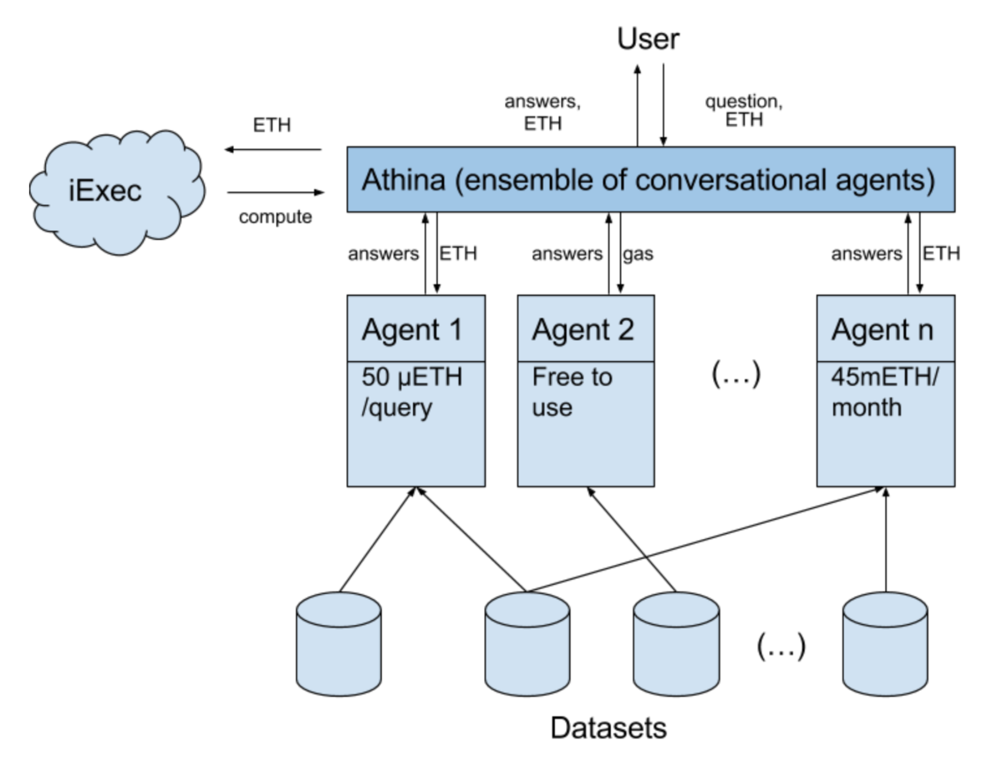

# Athina, conversational interface (iExec Dapp Challenge entry)

Codenamed “Athina”, it will be a conversational interface to
blockchain applications. It would work as an ensemble of agents, each
of which would be a dapp, built and monetized by different people.

iExec is an enabling technology for this project, because it will make small interactions with these agents profitable through microtransactions (even more so in the future, with possible fine-grained inter-agent reasoning). Here are two hypothetical examples of how Athina could work:

## Example 1.

Athina[pre-qa, my-interests, eu-legislation]: Hi John, this new article might interest you. It involves new regulations regarding financial asset tokenizations in Europe.

John: Thanks, could you summarize it?

Athina[summarization]: Sure, (...)

John: Thank you. How was The Economist’s response to these changes?

Athina[sentiment-analysis]: They are rather optimistic about their long term impact.

In this hypothetical example, the pre-qa agent has been looking for answers to questions which John might find interesting but hasn’t yet asked. It has been reading legal documents in the background (using iExec computational power) with the help of the eu-legislation dapp (a language understanding agent that is fine-tuned to process European legislation documents), and using data representations from the my-interests dapp to inform an attention mechanism. When John asks for a summary, Athina uses the summarization dapp agent to produce it.

## Example 2.

John: Hi Athina. I was wondering if this new drug for allergy prevention might work for me.

Athina[personal-genomics, my-SNPs, allergology-nlu]: Good news. You share the SNP profile of the patients who benefitted the most from this new drug. Talk to your doctor!

This example might be more pertinent because the user has a question that involves very private data — his genome. Blockchain technology will allow privacy preserving AI using techniques like homomorphic encryption, and is therefore the natural home for a cybernetic friend.

After being asked a question, Athina checks the confidence levels of each of its installed agents’ answers. In this case, allergology-nlu is capable of answering the question with, say, 95% certainty. This answer would probably be presented to the user. Other installed agents like, for instance, flight-routes, or world-history, would probably have quite low confidence scores for this question given their irrelevant expertise, and would thus not be selected.

## Component Diagram

## Roadmap
The goal is a proof of concept of an ensemble of conversational agents, each of which is a separate dapp. 

### Milestone 1 (≈2 weeks) - The simple chatbot
Build a conversational agent running on iExec computational resources.
### Milestone 2 (≈2 weeks)- An ensemble of dapp agents.
Build at least one more agent which would work with Athina in an
ensemble fashion.
### Milestone 3 (≈4 weeks) - Payment model
Implement a payment model which compensates agent designers for
usage.

### Future work (outside the scope of this plan)
Implement a marketplace of AI agents. Inter-agent reasoning models. Contemplate integration with OpenMined.

Powerful new economics will be at play in these micro-interactions. Additionally, a new kind of AI assistants might flourish. Agents like Siri will always be useful, but they can't be inside our minds, or deal with our most intimate thoughts and problems (eg. health issues), or be our close, trusted friends. This requires a level of trust, control and privacy which only the blockchain can provide. For these reasons iExec can offer very valuable services to these types of machine learning projects in the future.
