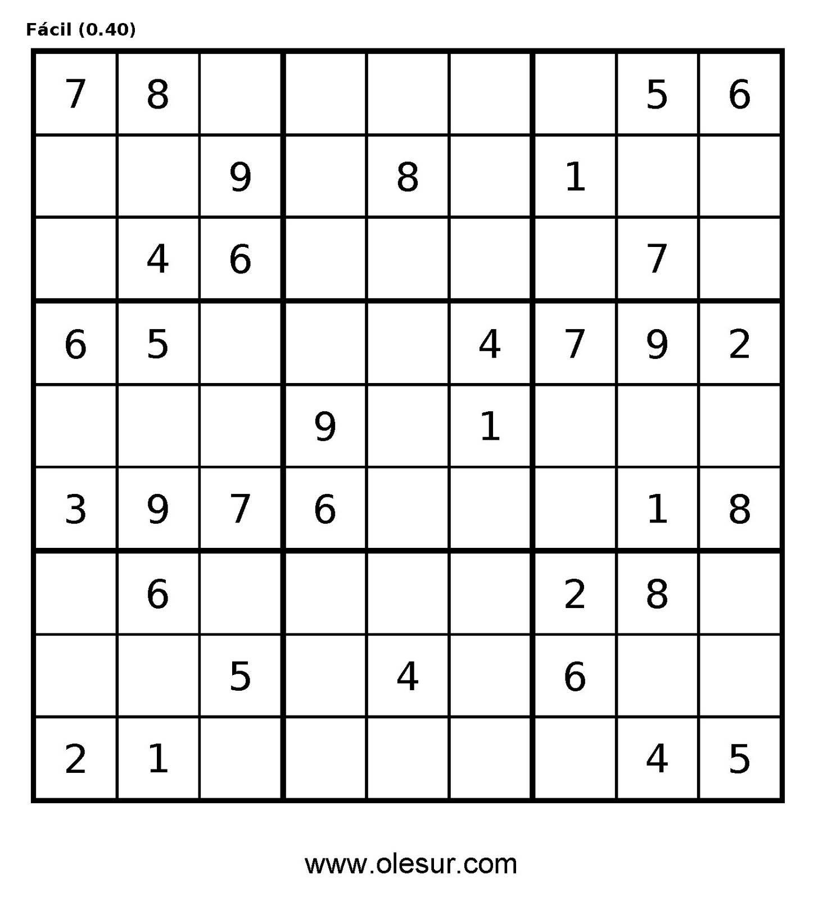
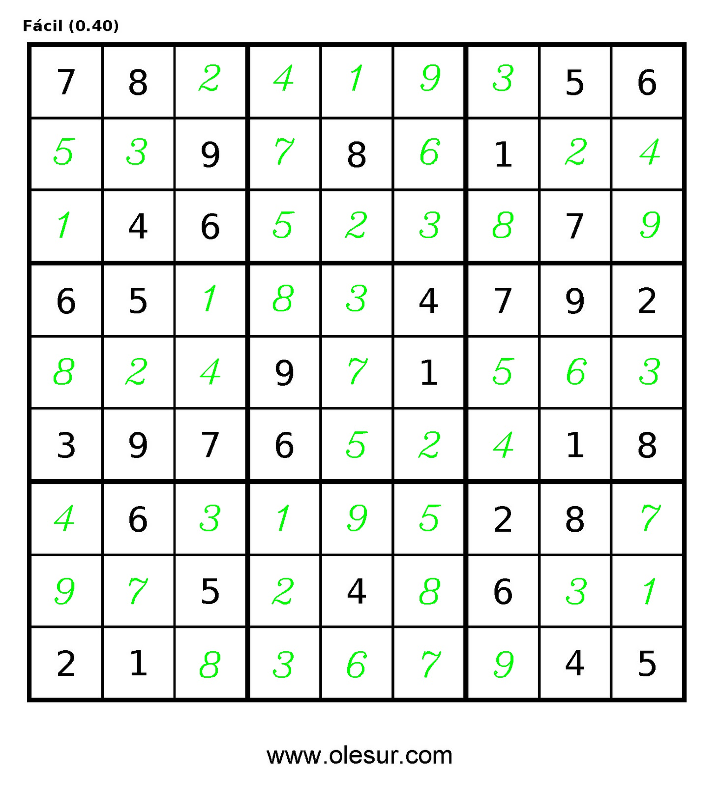

# sudokuOCR

This Dapp provides a sudoku solver with OCR.

## Usage:
python3 apps/sudokuOCR input [-o output]
* The input must be the path to an image containing a sudoku grid.
* The (optional) output is the path to the completed grid.
  Default: ./completed.png

## Example:

> python3 apps/sudokuOCR.py figures/grid.jpg -o figures/completed.jpg

> Solution: 782419356539786124146523879651834792824971563397652418463195287975248631218367945

## Dependencies:
* python3
	* argparse
	* cv2
	* numpy
	* PIL
	* pytesseract
* [tesseract](https://github.com/tesseract-ocr/tesseract)
