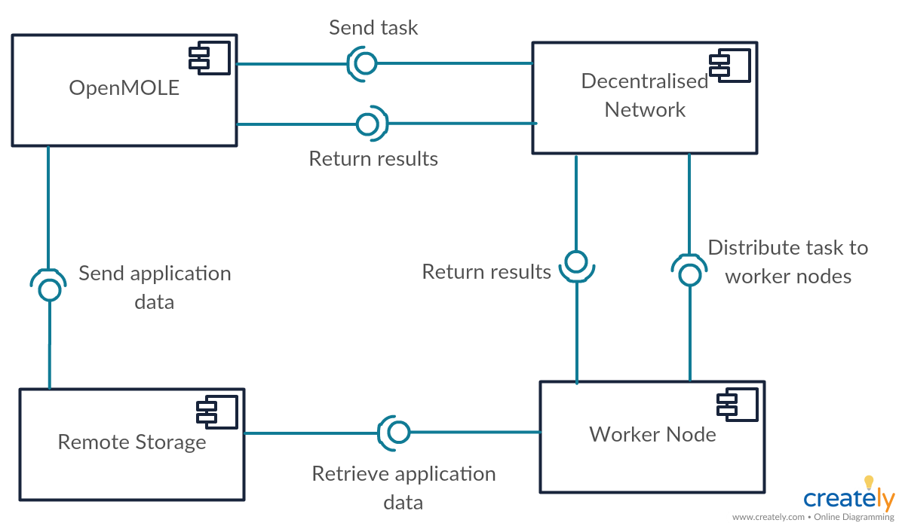
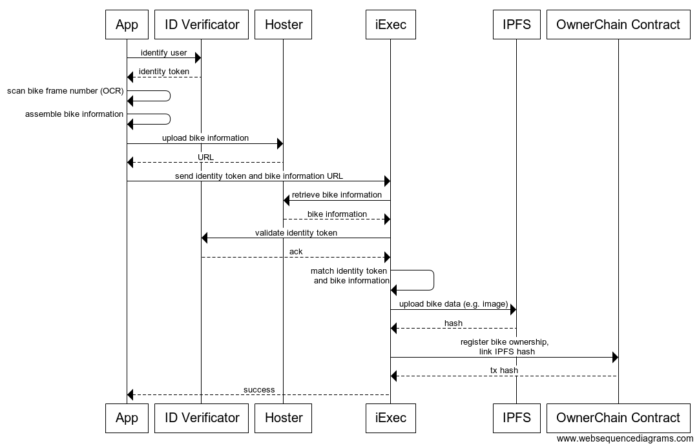

# OwnerChain

### Motivation

Provenance tracking is a common problem in various areas: Jewelers want to be sure that the diamonds they are using do not originate from conflict zones. Manufacturers of organic products have to ensure that all parts of their supply chain fulfill their specific requirements. Even wine collectors might demand proof that an expensive bottle is actually authentic. Provenance tracking establishes a verifiable history and provides trust that items have not been altered, stolen or forged.

To enable provenance tracking, some sort of ledger or record needs to be kept that includes all the required information about an article or asset. Even if such a ledger exists, though, it is difficult to verify its authenticity and that it has not been tampered with. There is always a need for trust between the involved parties, which is often undesirable.

With blockchain technology, however, a framework is emerging that might be able to solve most if not all the problems mentioned. Using a distributed ledger that is immune to manipulation --- if configured correctly --- allows for interactions that do not require trust and can be individually verified.

### Idea Proposal
Our DApp idea is to build a provenance tracking system in the iExec/Ethereum ecosystem. The prototype, called *OwnerChain*, is focused on tracking bicycles: Users are able to register bikes using trusted third party verifiers and validators. Users can refer to the DApp on local sales sites such as craigslist to provide a proof of their ownership. The system can then be used to safely transfer funds and ownership via the Ethereum blockchain.

iExec in conjunction with smart contracts provides trusted computation and will be used to power features extending the basic ownership use case:

- transfer of ownership
- enforcing rules, such as restricting the number of bikes per user
- analysing user behaviour for fraudulent activities
- semi-automatic verification of bike ownership through third party or machine learning
- extension to other assets, using other forms of verification

### Architecture

Fig. 1: Components in the Ownerchain system

The mobile client is the gateway for the user to register his bike to the system and buy/sell his bike using cryptocurrencies.
Third party verificator services are used to authenticate the user & the bike.
The iexec offchain app will serve as a trusted middleman to check legitimacy of requests and interact with smart contracts.
The Ownerchain smart contract will store ownership information and handle ownership transactions. IPFS will serve as a store for additional bike data.
The web frontend will serve as a simple way to view stored information on the ownerchain, submit buy/sell requests & offer some admin functionalities.

Fig. 2: Bike registration sequence diagram

Verifying the user ID is done via a third party app, such as Civic, which returns an identity token uniquely identifying the user. Using our OwnerChain app, the user scans the bike frame number and assembles further information about the bike (e.g., bike brand, year of purchase and similar information). Users will be required to include some proof of ownership, such as purchase receipts or a national bike registry entry.

This information is encrypted and uploaded to a generic file hoster. The app sends a registration request to the iExec service, including the identity token and the URL to the previously uploaded package. The package is then retrieved by iExec. The hoster may be skipped if direct data upload to iExec becomes available in the future. To authenticate that the identity token is legitimate, it is validated at the ID verifier. The bike serial number is used to search in known databases of stolen bikes for any matches, in which case the proposal would be rejected and the user flagged. The identity information is matched with the uploaded information about the bike. If everything is valid, the bike data is uploaded to a distributed file system for long-term storage. Then the bike gets registered on the blockchain via the OwnerChain contract.

The ownership proofs for bikes will be verified by hand at first --- automation of the verification will be the topic of further research. Machine-learning approaches, specifically image recognition and OCR with fallbacks to Amazon Mechanical Turk workers for doubtful cases are conceivable. In the long run, bicycle vendors will be incentivized to participate, securely recording the ownership transfer via specialized vendor authorization features, therefore completely alleviating the user trust issue.

The app will contain features to easily buy and sell bikes or transfer ownership by directly calling smart contract methods. The mobile app will therefore have an Ethereum address directly associated with the user, which constitutes the ownership in the smart contract and can be used to handle buying and selling by payment in Ether. 

### Roadmap
- OwnerChain smart contract implementation (ownership registration, transfer, escrow): *Q1 2018*
- implementation of off-chain application on iExec: *Q2 2018*
  - interaction with the OwnerChain smart contract    
  - retrieval and storage of data on IPFS
  - API access point for mobile app 
- implementation of simple web frontend: *Q2 2018*
   - web frontend for buy/sell/lookup functionality
   - offer simple bike registration procedure in interaction with iexec offchain app (replaced by mobile app later on)
- mobile app beta: *Q3 2018*
  - implement UI (upload forms for bike data) 
  - integrate identity verification 
  - interaction with offchain app
  - direct interaction with smart contracts 
- implement bike ownership verification: *Q3 2018*
- productive release on main net: *Q4 2018*
- expand to other assets 

### Background
We are two postgrad CS students and have previously developed academic prototypes of the smart contracts in this proposal. We want to use our experience to implement a working system usable in everyday life.
