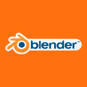

# Blender
## Description
Blender is a professional, free and open-source 3D computer graphics software toolset used for creating animated films, visual effects, art, 3D printed models, interactive 3D applications and video games. Blender's features include 3D modeling, UV unwrapping, texturing, raster graphics editing, rigging and skinning, fluid and smoke simulation, particle simulation, soft body simulation, sculpting, animating, match moving, camera tracking, rendering, motion graphics, video editing and compositing. It also features an integrated game engine.

## [Dapp params](./iexec.json)
