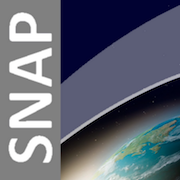

## [Description](http://step.esa.int/main/toolboxes/snap/)
A common architecture for all Sentinel Toolboxes is being jointly developed by Brockmann Consult, Array Systems Computing and C-S called the Sentinel Application Platform (SNAP).

The SNAP architecture is ideal for Earth Observation processing and analysis due to the following technological innovations: Extensibility, Portability, Modular Rich Client Platform, Generic EO Data Abstraction, Tiled Memory Management, and a Graph Processing Framework.",

APP eployed on iexec :

https://explorer.iex.ec/kovan/dapp/0x3819849da6817f4ca9d7c331baae26dec577b0b4b4a56f845460f6c39121c504

Transaction on kovan sucess :
https://explorer.iex.ec/kovan/work/0xf21e19453c1eba22c3de64b8b9a6db06e064069cdc17b34d211bbabad5333d09

## [Parameters](./iexec.json)
