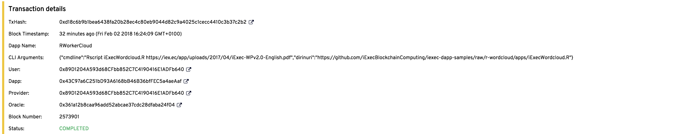

# R wordcloud

## Description

A Wordcloud is a graphic representation of words, typically those used in a document or website, in which the words are arranged artistically in close proximity and the size of each word's type is proportional to the word's frequency or to the size of a numeric variable associated with the word, such as the population associated with the name of a country.

We use R to generate this kind of wordcloud.

We have create a [R script](./iExecWordcloud.R) to analyse a pdf content and generate a wordcloud png image.

To run this R Script, we start on the r-base docker image and we add r wordcloud library and all needed dependencies.

This docker image has been pushed into this docker repository [iexechub/r-wordcloud image](https://hub.docker.com/r/iexechub/r-wordcloud/).

## [Dapp params](./iexec.json)

The pdf url to analyse, the R script to launch and the docker image to use must be configure into the [iexec.js](./iexec.json).

## Result

To test it, we give iExec Whitepaper pdf as input of the R Script : [iExec-WPv2.0-English.pdf](http://iex.ec/app/uploads/2017/04/iExec-WPv2.0-English.pdf).

You can see the wordcloud result of the iExec Whitepaper !!!

It was generated by this [transaction](https://explorer.iex.ec/ropsten/tx/0xd18c6b9b1bea6438fa20b28ec4c80eb9044d82c9a4025c1cecc4410c3b37c2b2) on ropsten !

